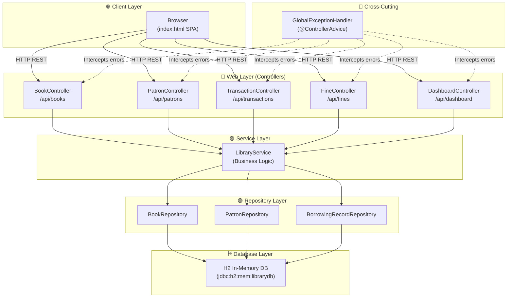
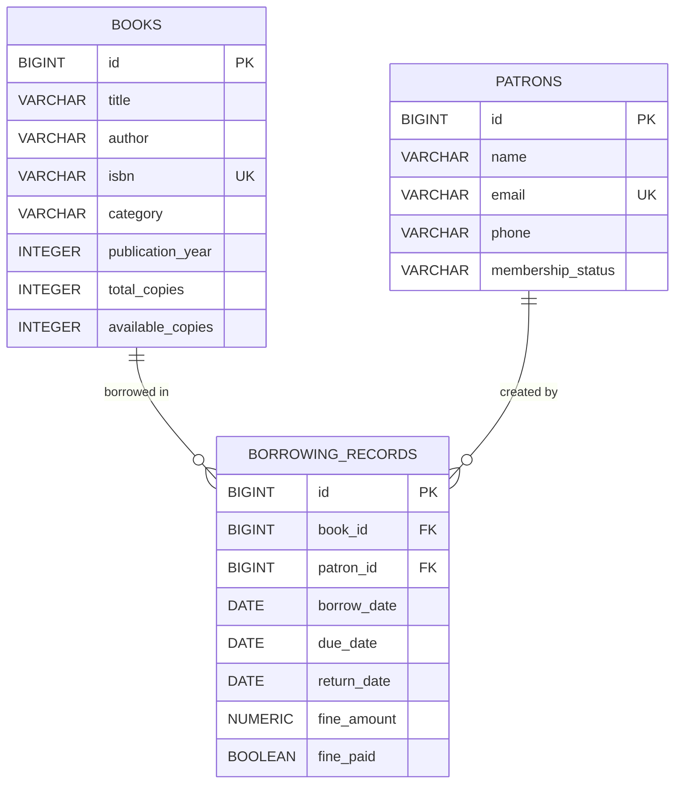
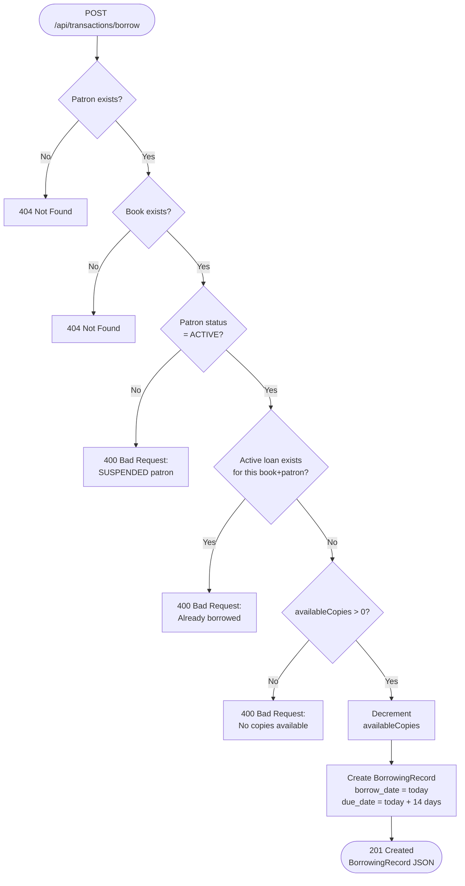
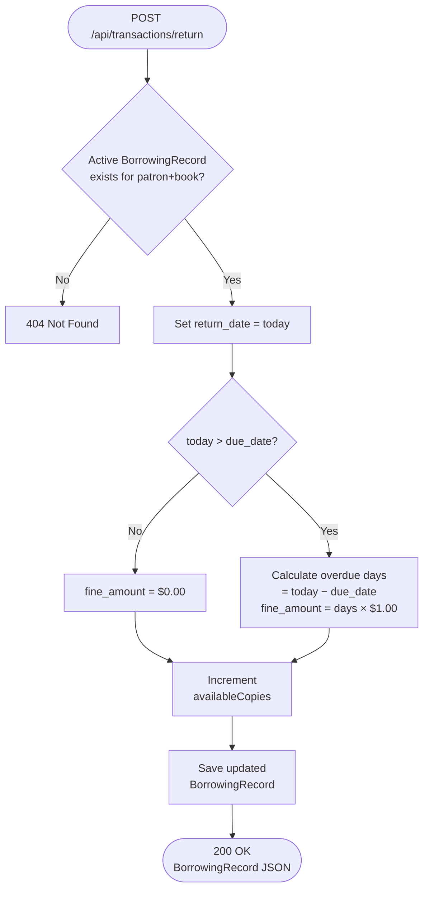
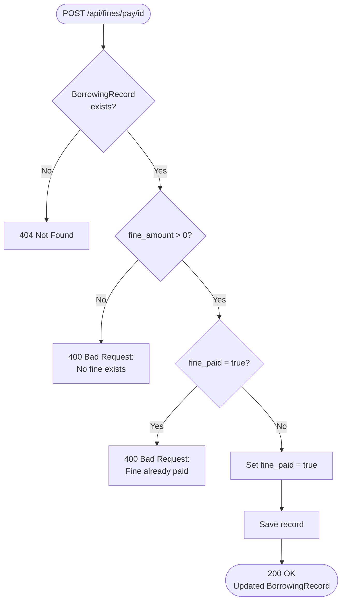
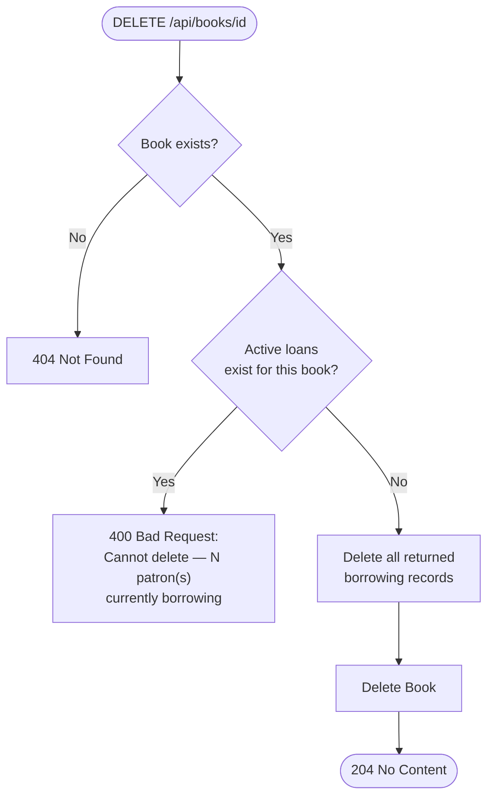
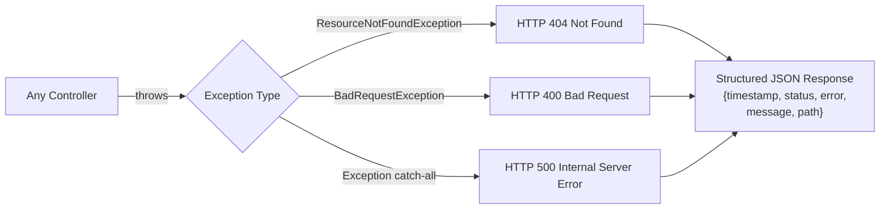
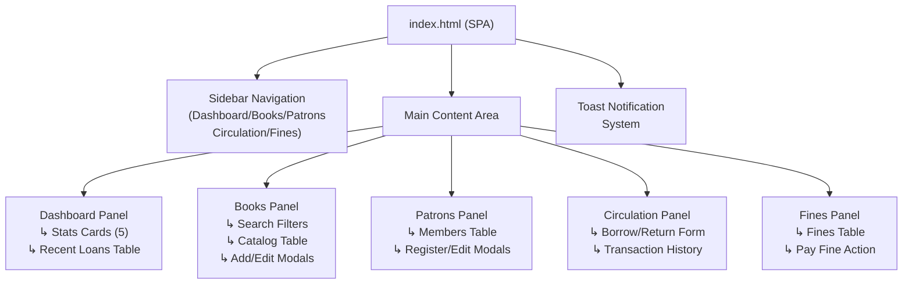

# Library Management System — Technical Report

**Version:** 1.0.0  
**Technology:** Spring Boot 4.0.6 · Java 21 · Spring Data JPA · H2 Database  
**Author:** Auto-generated  
**Date:** June 2026

---

## Table of Contents

1. [Project Overview](#1-project-overview)
2. [Technology Stack](#2-technology-stack)
3. [Project Structure](#3-project-structure)
4. [System Architecture](#4-system-architecture)
5. [Class Diagram](#5-class-diagram)
6. [Entity-Relationship (ER) Diagram](#6-entity-relationship-er-diagram)
7. [Business Logic Flow Diagrams](#7-business-logic-flow-diagrams)
   - 7.1 Borrow Book Flow
   - 7.2 Return Book Flow
   - 7.3 Fine Payment Flow
8. [API Documentation](#8-api-documentation)
   - 8.1 Books API
   - 8.2 Patrons API
   - 8.3 Transactions API
   - 8.4 Fines API
   - 8.5 Dashboard API
9. [Exception Handling](#9-exception-handling)
10. [Data Initialization](#10-data-initialization)
11. [Frontend SPA Overview](#11-frontend-spa-overview)
12. [Running the Application](#12-running-the-application)
13. [Testing](#13-testing)

---

## 1. Project Overview

The **Library Management System (LMS)** is a full-stack web application that provides a comprehensive RESTful API backend and a modern single-page frontend for managing a library's daily operations.

### Core Capabilities

| Feature | Description |
|---|---|
| 📚 Book Catalog | Add, edit, delete, and search books with multi-copy inventory tracking |
| 👥 Patron Management | Register, update, and manage library members with status control |
| 🔄 Circulation | Issue and return books with automated inventory decrement/increment |
| ⚠️ Overdue Fines | Automatic $1.00/day fine calculation for late returns |
| 💰 Fine Settlement | Track and mark overdue fines as paid |
| 📊 Dashboard Analytics | Live library statistics — total books, patrons, active loans, overdue count |
| 🌐 Web UI | Modern dark-mode single-page frontend served by Spring Boot |

---

## 2. Technology Stack

| Layer | Technology | Version |
|---|---|---|
| Language | Java | 21 |
| Framework | Spring Boot | 4.0.6 |
| Web Layer | Spring Web MVC | 7.0.7 |
| Persistence | Spring Data JPA | 4.0.5 |
| ORM | Hibernate | 7.2.12.Final |
| Database | H2 (in-memory) | 2.4.240 |
| JSON | Jackson (tools.jackson) | 3.1.2 |
| Connection Pool | HikariCP | 7.0.2 |
| Build Tool | Maven (mvnw wrapper) | — |
| Testing | JUnit 5 / MockMvc | 6.0.3 |
| Frontend | Vanilla HTML5 / CSS3 / ES6 | — |
| Fonts | Google Fonts (Outfit) | — |

---

## 3. Project Structure

```
libraryManagementSystem/
├── src/
│   ├── main/
│   │   ├── java/com/example/libraryManagementSystem/
│   │   │   ├── LibraryManagementSystemApplication.java   ← Entry Point
│   │   │   ├── config/
│   │   │   │   └── DataInitializer.java                  ← Demo Data Seeder
│   │   │   ├── controller/
│   │   │   │   ├── BookController.java                   ← /api/books
│   │   │   │   ├── PatronController.java                 ← /api/patrons
│   │   │   │   ├── TransactionController.java            ← /api/transactions
│   │   │   │   ├── FineController.java                   ← /api/fines
│   │   │   │   └── DashboardController.java              ← /api/dashboard
│   │   │   ├── dto/
│   │   │   │   ├── BorrowRequest.java
│   │   │   │   ├── ReturnRequest.java
│   │   │   │   └── DashboardStats.java
│   │   │   ├── exception/
│   │   │   │   ├── ResourceNotFoundException.java
│   │   │   │   ├── BadRequestException.java
│   │   │   │   └── GlobalExceptionHandler.java
│   │   │   ├── model/
│   │   │   │   ├── Book.java
│   │   │   │   ├── Patron.java
│   │   │   │   └── BorrowingRecord.java
│   │   │   ├── repository/
│   │   │   │   ├── BookRepository.java
│   │   │   │   ├── PatronRepository.java
│   │   │   │   └── BorrowingRecordRepository.java
│   │   │   └── service/
│   │   │       └── LibraryService.java
│   │   └── resources/
│   │       ├── application.properties
│   │       └── static/
│   │           └── index.html                            ← Frontend SPA
│   └── test/
│       └── java/com/example/libraryManagementSystem/
│           ├── LibraryIntegrationTests.java
│           └── LibraryManagementSystemApplicationTests.java
└── pom.xml
```

---

## 4. System Architecture

The application follows a classic **Layered Architecture** (also known as N-Tier), divided into:



### Layer Responsibilities

| Layer | Responsibility |
|---|---|
| **Controller** | Receives HTTP requests, validates inputs, delegates to service, formats HTTP responses |
| **Service** | Enforces all business rules, orchestrates multiple repository calls, handles transactions |
| **Repository** | Data access abstraction using Spring Data JPA, provides JPQL queries |
| **Model** | JPA entities that map to H2 database tables |
| **DTO** | Request/response transfer objects to decouple API from internal model |
| **Exception** | Centralized error handling and standardized JSON error responses |

---

## 5. Class Diagram

```mermaid
classDiagram
    class Book {
        +Long id
        +String title
        +String author
        +String isbn
        +String category
        +Integer publicationYear
        +Integer totalCopies
        +Integer availableCopies
        +getId() Long
        +setAvailableCopies(int)
    }

    class Patron {
        +Long id
        +String name
        +String email
        +String phone
        +String membershipStatus
        +getId() Long
        +getMembershipStatus() String
    }

    class BorrowingRecord {
        +Long id
        +Book book
        +Patron patron
        +LocalDate borrowDate
        +LocalDate dueDate
        +LocalDate returnDate
        +BigDecimal fineAmount
        +boolean finePaid
        +isFinePaid() boolean
        +setReturnDate(LocalDate)
        +setFineAmount(BigDecimal)
    }

    class BorrowRequest {
        +Long bookId
        +Long patronId
    }

    class ReturnRequest {
        +Long bookId
        +Long patronId
    }

    class DashboardStats {
        +long totalBooks
        +long totalCopies
        +long totalPatrons
        +long activeLoansCount
        +long overdueLoansCount
        +BigDecimal totalOutstandingFines
    }

    class BookRepository {
        +findByIsbn(String) Optional~Book~
        +existsByIsbn(String) boolean
        +searchBooks(title, author, category, isbn) List~Book~
    }

    class PatronRepository {
        +findByEmail(String) Optional~Patron~
        +existsByEmail(String) boolean
    }

    class BorrowingRecordRepository {
        +findByBookIdAndPatronIdAndReturnDateIsNull() Optional~BorrowingRecord~
        +findByPatronIdAndReturnDateIsNull() List~BorrowingRecord~
        +countByReturnDateIsNull() long
        +countByReturnDateIsNullAndDueDateBefore() long
        +sumTotalOutstandingFines() BigDecimal
        +searchTransactions() List~BorrowingRecord~
    }

    class LibraryService {
        -BookRepository bookRepository
        -PatronRepository patronRepository
        -BorrowingRecordRepository borrowingRecordRepository
        +saveBook(Book) Book
        +searchBooks(title,author,category,isbn) List~Book~
        +getBookById(Long) Book
        +updateBook(Long, Book) Book
        +deleteBook(Long)
        +savePatron(Patron) Patron
        +getAllPatrons() List~Patron~
        +getPatronById(Long) Patron
        +updatePatron(Long, Patron) Patron
        +deletePatron(Long)
        +borrowBook(Long, Long) BorrowingRecord
        +returnBook(Long, Long) BorrowingRecord
        +payFine(Long) BorrowingRecord
        +getTransactionHistory() List~BorrowingRecord~
        +getFines() List~BorrowingRecord~
        +getDashboardStats() DashboardStats
    }

    class BookController {
        -LibraryService libraryService
        +addBook(Book) ResponseEntity
        +getBooks(filters) ResponseEntity
        +getBookById(Long) ResponseEntity
        +updateBook(Long, Book) ResponseEntity
        +deleteBook(Long) ResponseEntity
    }

    class PatronController {
        -LibraryService libraryService
        +addPatron(Patron) ResponseEntity
        +getAllPatrons() ResponseEntity
        +getPatronById(Long) ResponseEntity
        +updatePatron(Long, Patron) ResponseEntity
        +deletePatron(Long) ResponseEntity
    }

    class TransactionController {
        -LibraryService libraryService
        +borrowBook(BorrowRequest) ResponseEntity
        +returnBook(ReturnRequest) ResponseEntity
        +getHistory(filters) ResponseEntity
    }

    class FineController {
        -LibraryService libraryService
        +getFines(patronId, unpaidOnly) ResponseEntity
        +payFine(Long) ResponseEntity
    }

    class DashboardController {
        -LibraryService libraryService
        +getStats() ResponseEntity
    }

    class GlobalExceptionHandler {
        +handleResourceNotFoundException() ResponseEntity
        +handleBadRequestException() ResponseEntity
        +handleGlobalException() ResponseEntity
    }

    BorrowingRecord --> Book : borrows
    BorrowingRecord --> Patron : by
    LibraryService --> BookRepository : uses
    LibraryService --> PatronRepository : uses
    LibraryService --> BorrowingRecordRepository : uses
    BookController --> LibraryService : delegates
    PatronController --> LibraryService : delegates
    TransactionController --> LibraryService : delegates
    FineController --> LibraryService : delegates
    DashboardController --> LibraryService : delegates
```



---

## 6. Entity-Relationship (ER) Diagram



### Table Constraints

| Table | Constraint |
|---|---|
| `books.isbn` | UNIQUE — no duplicate ISBNs |
| `patrons.email` | UNIQUE — no duplicate email addresses |
| `borrowing_records.book_id` | FK → books(id) |
| `borrowing_records.patron_id` | FK → patrons(id) |

---

## 7. Business Logic Flow Diagrams

### 7.1 Borrow Book Flow



### 7.2 Return Book Flow



### 7.3 Fine Payment Flow



### 7.4 Delete Book Safety Check



---

## 8. API Documentation

### Base URL
```
http://localhost:8080/api
```

### Standard Error Response Format
```json
{
  "timestamp": "2026-06-03T16:45:00",
  "status": 404,
  "error": "Not Found",
  "message": "Book with ID 99 not found.",
  "path": "/api/books/99"
}
```

---

### 8.1 Books API — `/api/books`

#### `POST /api/books` — Add a New Book

**Request Body:**
```json
{
  "title": "Clean Code",
  "author": "Robert C. Martin",
  "isbn": "9780132350884",
  "category": "Programming",
  "publicationYear": 2008,
  "totalCopies": 3
}
```

**Response `201 Created`:**
```json
{
  "id": 1,
  "title": "Clean Code",
  "author": "Robert C. Martin",
  "isbn": "9780132350884",
  "category": "Programming",
  "publicationYear": 2008,
  "totalCopies": 3,
  "availableCopies": 3
}
```

**Errors:** `400` if ISBN already exists.

---

#### `GET /api/books` — Search Books

**Query Parameters (all optional):**

| Param | Type | Description |
|---|---|---|
| `title` | String | Partial match (case-insensitive) |
| `author` | String | Partial match (case-insensitive) |
| `category` | String | Exact match (case-insensitive) |
| `isbn` | String | Exact match |

**Examples:**
```
GET /api/books
GET /api/books?title=clean&category=Programming
GET /api/books?isbn=9780132350884
```

**Response `200 OK`:** Array of Book objects.

---

#### `GET /api/books/{id}` — Get Book by ID

**Response `200 OK`:** Single Book object.  
**Errors:** `404` if book not found.

---

#### `PUT /api/books/{id}` — Update Book

**Request Body:** Any subset of book fields (only provided fields are updated).

```json
{
  "totalCopies": 5,
  "category": "Software Engineering"
}
```

**Response `200 OK`:** Updated Book object.  
**Errors:** `404` if not found, `400` if new ISBN conflicts, `400` if reducing copies below currently borrowed count.

---

#### `DELETE /api/books/{id}` — Delete Book

**Response `204 No Content`**  
**Errors:** `404` if not found, `400` if book has active loans.

---

### 8.2 Patrons API — `/api/patrons`

#### `POST /api/patrons` — Register Patron

**Request Body:**
```json
{
  "name": "Alice Johnson",
  "email": "alice@example.com",
  "phone": "555-0192",
  "membershipStatus": "ACTIVE"
}
```

**Response `201 Created`:** Patron object.  
**Errors:** `400` if email already registered.

---

#### `GET /api/patrons` — List All Patrons

**Response `200 OK`:** Array of Patron objects.

---

#### `GET /api/patrons/{id}` — Get Patron by ID

**Response `200 OK`:** Single Patron object.  
**Errors:** `404` if not found.

---

#### `PUT /api/patrons/{id}` — Update Patron

**Request Body:**
```json
{
  "membershipStatus": "SUSPENDED"
}
```

**Response `200 OK`:** Updated Patron object.

---

#### `DELETE /api/patrons/{id}` — Delete Patron

**Response `204 No Content`**  
**Errors:** `404` if not found, `400` if patron has active loans.

---

### 8.3 Transactions API — `/api/transactions`

#### `POST /api/transactions/borrow` — Issue a Book

**Request Body:**
```json
{
  "patronId": 1,
  "bookId": 2
}
```

**Response `201 Created`:**
```json
{
  "id": 1,
  "book": { "id": 2, "title": "Clean Code", "availableCopies": 2 },
  "patron": { "id": 1, "name": "Alice Johnson" },
  "borrowDate": "2026-06-03",
  "dueDate": "2026-06-17",
  "returnDate": null,
  "fineAmount": 0,
  "finePaid": false
}
```

**Errors:**
- `404` Patron or Book not found
- `400` Patron is SUSPENDED
- `400` No copies available
- `400` Patron already has active loan of this book

---

#### `POST /api/transactions/return` — Return a Book

**Request Body:**
```json
{
  "patronId": 1,
  "bookId": 2
}
```

**Response `200 OK`:** Updated BorrowingRecord with `returnDate` and `fineAmount` populated.

**Fine Calculation:** `$1.00 × number of overdue days`

---

#### `GET /api/transactions/history` — Get Transaction History

**Query Parameters (all optional):**

| Param | Type | Description |
|---|---|---|
| `patronId` | Long | Filter by patron |
| `bookId` | Long | Filter by book |
| `activeOnly` | Boolean | Show only unreturned loans |

**Response `200 OK`:** Array of BorrowingRecord objects.

---

### 8.4 Fines API — `/api/fines`

#### `GET /api/fines` — List Fines

**Query Parameters (all optional):**

| Param | Type | Description |
|---|---|---|
| `patronId` | Long | Filter by patron |
| `unpaidOnly` | Boolean | Show only unpaid fines |

**Response `200 OK`:** Array of BorrowingRecord objects where `fineAmount > 0`.

---

#### `POST /api/fines/pay/{id}` — Pay a Fine

**Path Variable:** `id` = BorrowingRecord ID

**Response `200 OK`:** Updated BorrowingRecord with `finePaid: true`.  
**Errors:** `404` not found, `400` if no fine exists or already paid.

---

### 8.5 Dashboard API — `/api/dashboard`

#### `GET /api/dashboard/stats` — Library Statistics

**Response `200 OK`:**
```json
{
  "totalBooks": 4,
  "totalCopies": 11,
  "totalPatrons": 3,
  "activeLoansCount": 2,
  "overdueLoansCount": 0,
  "totalOutstandingFines": 0.00
}
```

---

## 9. Exception Handling

All exceptions are handled centrally by `GlobalExceptionHandler` annotated with `@ControllerAdvice`.



### Custom Exception Classes

| Class | Extends | Used When |
|---|---|---|
| `ResourceNotFoundException` | `RuntimeException` | Entity not found by ID |
| `BadRequestException` | `RuntimeException` | Business rule violation |

---

## 10. Data Initialization

`DataInitializer` implements `CommandLineRunner` and runs on every startup. It seeds data **only if the tables are empty** (idempotent):

### Demo Patrons Seeded

| Name | Email | Status |
|---|---|---|
| Alice Johnson | alice@example.com | ACTIVE |
| Bob Smith | bob@example.com | ACTIVE |
| Charlie Brown | charlie@example.com | SUSPENDED |

### Demo Books Seeded

| Title | Author | Category | Copies |
|---|---|---|---|
| The Great Gatsby | F. Scott Fitzgerald | Fiction | 3 |
| To Kill a Mockingbird | Harper Lee | Fiction | 2 |
| A Brief History of Time | Stephen Hawking | Science | 1 |
| The Hobbit | J.R.R. Tolkien | Fantasy | 5 |

---

## 11. Frontend SPA Overview

The frontend is a **single HTML file** (`/static/index.html`) served automatically by Spring Boot as the welcome page.

### Design System

| Element | Value |
|---|---|
| Background | `#090e1a` (deep navy) |
| Panel | `#0f1729` |
| Cards | Glassmorphism `rgba(255,255,255,0.035)` |
| Accent Blue | `#63b3ed` |
| Accent Violet | `#b794f4` |
| Accent Green | `#68d391` |
| Font | Outfit (Google Fonts) |
| Border Radius | 14px cards, 8px inputs |

### UI Component Map



### JavaScript Modules

| Function | Purpose |
|---|---|
| `navigate(page)` | Client-side tab switching |
| `api(method, path, body)` | Central async Fetch API wrapper |
| `toast(msg, type)` | Notification system (success/error/info) |
| `loadDashboard()` | Fetches stats + active loans |
| `loadBooks()` | Fetches books with filter params |
| `saveBook()` / `updateBook()` | POST/PUT book operations |
| `loadPatrons()` | Fetches all patrons |
| `savePatron()` / `updatePatron()` | POST/PUT patron operations |
| `doBorrow()` / `doReturn()` | Circulation desk actions |
| `loadTransactions()` | Fetches borrowing history |
| `loadFines()` | Fetches fine records |
| `payFine(id)` | Marks fine as paid |

---

## 12. Running the Application

### Prerequisites
- Java 21+
- Maven (included via `mvnw` wrapper)
- No external database required — H2 runs in-memory

### Steps

```bash
# 1. Navigate to project directory
cd D:\study\java\libraryManagementSystem\libraryManagementSystem

# 2. Start the application
.\mvnw spring-boot:run

# 3. Wait for startup message:
#    "Demo Patrons successfully initialized."
#    "Demo Books successfully initialized."
```

### Access URLs

| Resource | URL |
|---|---|
| 🌐 Web Application | http://localhost:8080 |
| 🗄️ H2 Console | http://localhost:8080/h2-console |
| 📡 Books API | http://localhost:8080/api/books |
| 📡 Patrons API | http://localhost:8080/api/patrons |
| 📡 Transactions API | http://localhost:8080/api/transactions/history |
| 📡 Dashboard API | http://localhost:8080/api/dashboard/stats |

### H2 Console Connection Settings

| Field | Value |
|---|---|
| JDBC URL | `jdbc:h2:mem:librarydb` |
| Username | `sa` |
| Password | *(leave blank)* |

### Configuration (`application.properties`)

```properties
spring.datasource.url=jdbc:h2:mem:librarydb;DB_CLOSE_DELAY=-1
spring.h2.console.enabled=true
spring.h2.console.path=/h2-console
spring.jpa.show-sql=true
spring.jpa.hibernate.ddl-auto=update
```

---

## 13. Testing

### Test Files

| File | Type | Tests |
|---|---|---|
| `LibraryIntegrationTests.java` | Integration (MockMvc) | 6 |
| `LibraryManagementSystemApplicationTests.java` | Context Load | 1 |

### Integration Test Coverage

| Test Method | What It Verifies |
|---|---|
| `testCreateAndGetBook` | POST book → 201, GET books → list with 1 entry |
| `testCreateAndGetPatron` | POST patron → 201, GET patrons → list with 1 entry |
| `testBorrowAndReturnBook` | Full borrow cycle, stock decrements, prevents duplicate borrow, return resets stock + fine |
| `testBorrowFailsForOutofStockBook` | `availableCopies=0` → 400 |
| `testBorrowFailsForSuspendedPatron` | SUSPENDED patron → 400 |
| `testGetDashboardStats` | Stats counts are accurate after seeding |

### Running Tests

```bash
.\mvnw clean test
```

**Expected Output:**
```
Tests run: 7, Failures: 0, Errors: 0, Skipped: 0
BUILD SUCCESS
```

---

*Report generated for Library Management System v1.0.0 — Spring Boot 4.0.6*
